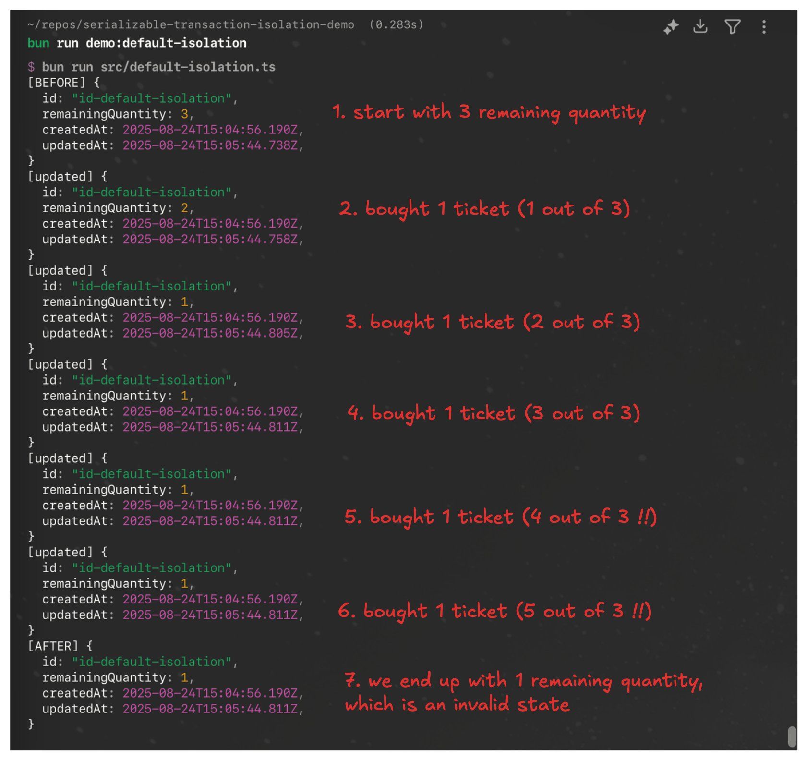
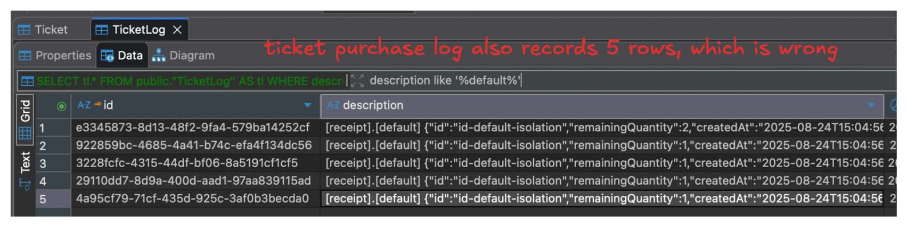
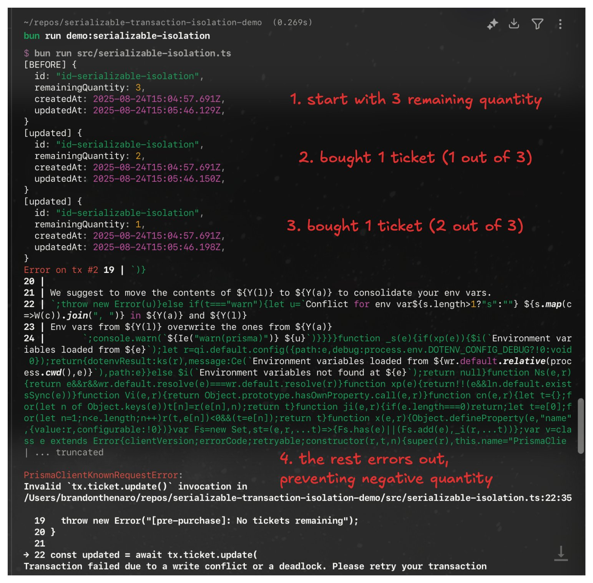
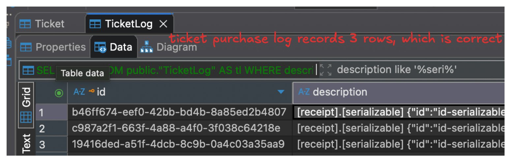
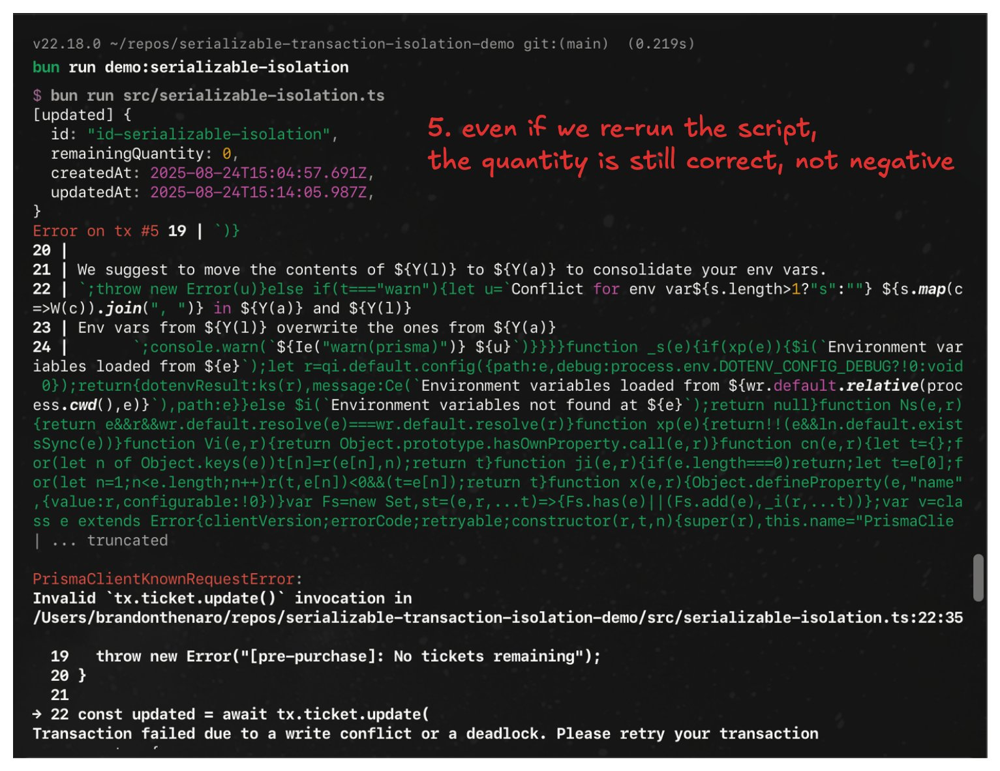
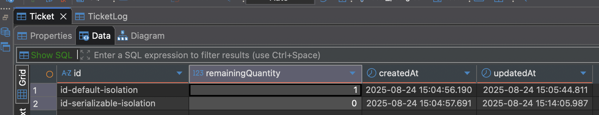
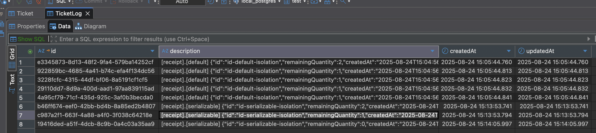

# serializable-transaction-isolation-demo

This project was created using `bun init` in bun v1.2.20. [Bun](https://bun.com) is a fast all-in-one JavaScript runtime.

## Getting Started

```sh
bun install

bun prisma db push # --force-reset # force reset if want to start from clean state

# don't forget to point DATABASE_URL to your DB
cp .env.example .env

bun run demo:default-isolation

bun run demo:serializable-isolation
```

## About

This repository contains code example that simulate the failure of default isolation level of SQL database to handle thundering herd problem that tries to purchase something that has limited resource like a concert ticket, and how Serializable transaction isolation level can help.

### Default isolation problem demo





### Serialization isolation solution demo







### Final DB State

> 🔍 Notice how the default isolation level has 5 rows in `TicketLog` table, meaning that even though the remaining quantity is 3, there are 5 acknowledged purchases, which is wrong




